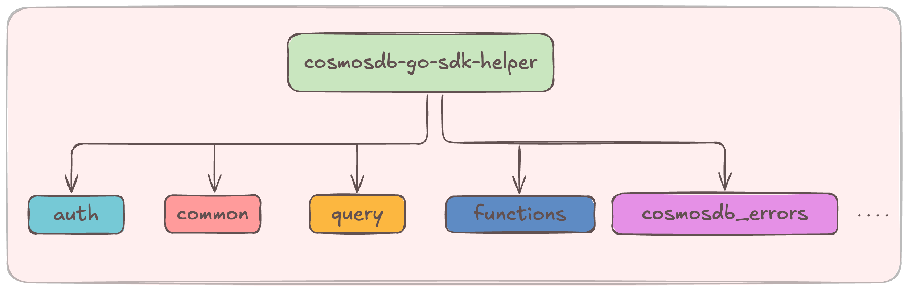

# Azure Cosmos DB Go SDK Helper



A helper package providing convenience functions for working with the [Go SDK for Azure Cosmos DB NoSQL API](https://learn.microsoft.com/en-us/azure/cosmos-db/nosql/sdk-go). This includes utilities for authentication, querying, database and container operations, error handling, etc.

Packages:

- [auth](auth): Authentication utilities for Azure Cosmos DB
- [common](common): Common database and container operations
- [query](query): Query related utilities, including retrieving data using generic types
- [functions/trigger](functions/trigger): Handle Azure Functions Cosmos DB trigger payloads
- [cosmosdb_errors](cosmosdb_errors): Error handling for Cosmos DB operations

## Installation

```bash
go get github.com/abhirockzz/cosmosdb-go-sdk-helper
```

## Quick Start

> Refer to [this folder](examples) for examples.

```go
package main

import (
    "fmt"
    "log"

    "github.com/abhirockzz/cosmosdb-go-sdk-helper/auth"
    "github.com/abhirockzz/cosmosdb-go-sdk-helper/common"
    "github.com/abhirockzz/cosmosdb-go-sdk-helper/query"
)

// error handling omitted for brevity
func main() {
    // Auth using Microsoft Entra ID
    client, err := auth.GetCosmosDBClient("your-cosmos-endpoint", false, nil)

    // Create database if not exists
    db, err := common.CreateDatabaseIfNotExists(client, "mydb")

    // Create container if not exists
    container, err := common.CreateContainerIfNotExists(db, "mycontainer")
    
    type Task struct {
        ID   string `json:"id"`
        Info string `json:"info"`
    }

    insertedTask, err := common.InsertItemWithResponse(container, Task{
        ID:   "45",
        Info: "Sample task",
    }, azcosmos.NewPartitionKeyString("45"), nil)

    tasks, err := query.QueryItems[Task](container, "SELECT * FROM c", azcosmos.NewPartitionKey(), nil)

    for _, task := range tasks {
        fmt.Printf("Task: %s (%s)\n", task.ID, task.Info)
    }
}
```

## Authentication

You can use a common authentication method to connect to Azure Cosmos DB service and local emulator authentication.

`GetCosmosDBClient` uses `DefaultAzureCredential` for authentication to Cosmos DB service:

```go
client, err := auth.GetCosmosDBClient("https://your-account.documents.azure.com:443", false, nil)
if err != nil {
    log.Fatalf("Azure AD auth failed: %v", err)
}
```

For the emulator set `useEmulator` flag to `true` and pass the URL (e.g. `http://localhost:8081`):

```go
client, err := auth.GetCosmosDBClient("http://localhost:8081", true, nil)
if err != nil {
    log.Fatalf("Emulator auth failed: %v", err)
}
```

## Database and Container Operations

- `CreateDatabaseIfNotExists`: Creates a database only if it doesn't already exist
- `GetAllDatabases`: Retrieves a list of all databases in your Cosmos account
- `CreateContainerIfNotExists`: Creates a container only if it doesn't already exist
- `GetAllContainers`: Retrieves a list of all containers in a database

## Query operations

- `QueryItems`: Executes a SQL query against a container and returns the results
- `QueryItem`: Retrieves a single item from a container using its ID and partition key

## Azure Functions triggers for Cosmos DB

The `functions/trigger` package provides helpers for working with Azure Functions that are triggered by Azure Cosmos DB changes. When an Azure Function is triggered by Cosmos DB, the payload containing the changed documents has a specific structure. The `trigger` package helps in parsing this payload.

- `ParseToCosmosDBDataMap`: Unmarshals the Azure Functions Cosmos DB trigger payload and extracts the documents into a `[]map[string]any`. This is useful when you want to work with the documents as generic maps.
- `ParseToRawString`: Partially unmarshals the trigger payload to extract the `documents` field as a raw JSON string. This can be useful if you need to apply custom unmarshalling logic or pass the raw JSON string to another process.

## Error Handling

Error handling for Cosmos DB operations:

```go
if err != nil {
    cosmosError := cosmosdb_errors.GetError(err)
    if cosmosError.Status == http.StatusNotFound {
        // Handle resource not found
    }
    // Handle other errors
}
```